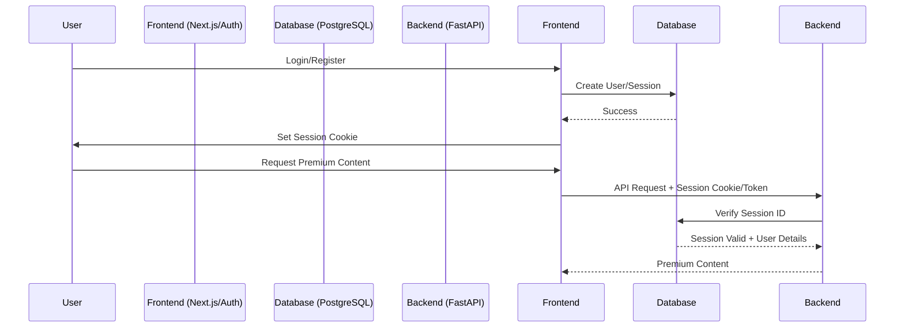

# Better Auth Integration Skill

## Purpose

Better Auth is a TypeScript-first authentication framework. In our hybrid architecture, it manages user sessions and accounts within the Next.js environment, while the FastAPI backend verifies these sessions to gate premium features.

## Integration Architecture



## Implementation Workflow

### Step 1: Frontend Setup (Next.js)

1. **Install Dependencies:**
   ```bash
   npm install better-auth pg
   ```

2. **Server-side Config (`src/lib/auth.ts`):**
   ```typescript
   import { betterAuth } from "better-auth";
   import { Pool } from "pg";

   export const auth = betterAuth({
     database: new Pool({
       connectionString: process.env.DATABASE_URL,
     }),
     emailAndPassword: {
       enabled: true,
       autoSignIn: true,
     },
   });
   ```

3. **Client-side Client (`src/lib/auth-client.ts`):**
   ```typescript
   import { createAuthClient } from "better-auth/react";
   export const authClient = createAuthClient({
     baseURL: process.env.NEXT_PUBLIC_APP_URL || "http://localhost:3000",
   });
   ```

4. **API Route Handler (`src/pages/api/auth/[...all].ts`):**
   ```typescript
   import { toNodeHandler } from "better-auth/node";
   import { auth } from "@/lib/auth";
   export const config = { api: { bodyParser: false } };
   export default toNodeHandler(auth.handler);
   ```

### Step 2: Backend Integration (FastAPI)

Since Better Auth is TS-based, the Python backend must verify sessions by querying the `session` and `user` tables directly or via a shared secret/JWT if configured.

1. **Session Verification Logic:**
   Update `app/auth.py` to read the session token from cookies/headers and query the Better Auth `session` table.

2. **Schema Alignment:**
   Ensure the `User` model in SQLAlchemy matches the fields Better Auth creates (e.g., `id` is a string/cuid by default in Better Auth, not a UUID).

## Key Principles

- **Single Source of Truth:** The database tables managed by Better Auth are the source of truth for user data.
- **Cross-Language Session Sharing:** The backend must be able to read the session database populated by the Node.js frontend.
- **Zero-Backend-LLM Compliance:** Session verification must be deterministic and must not call LLM APIs.

## Quality Checklist

- [ ] Users can register and login via the frontend.
- [ ] Session cookie is correctly sent to the FastAPI backend.
- [ ] Backend successfully validates session and retrieves user tier.
- [ ] Premium features remain gated based on the verified tier.
